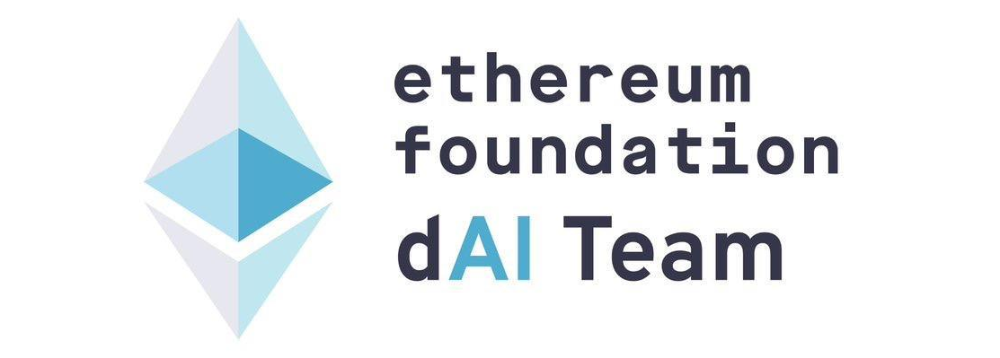
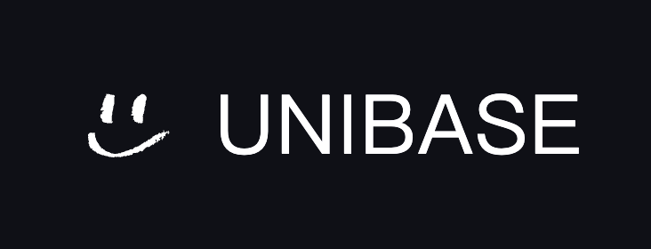

# 通用 AI 共学黑客松

[报名列表 👉 ](https://github.com/CasualHackathon/UniversalAI-ZetaChain?tab=contributing-ov-file#-%E6%8A%A5%E5%90%8D%E5%8F%82%E8%B5%9B)

[参赛项目列表 👉 ](https://github.com/CasualHackathon/UniversalAI-ZetaChain?tab=contributing-ov-file#-%E5%8F%82%E8%B5%9B%E9%A1%B9%E7%9B%AE%E6%8F%90%E4%BA%A4)

**去中心化且无需信任的 AI 智能体**正在重塑以太坊生态系统，**ERC-8004** 是其核心。

本次虚拟 **Casual Hackathon** 将于 **11 月 2 日至 11 月 9 日**举行，包含头脑风暴、团队匹配、工作坊、AMA、开放日和演示日等活动。欢迎提前报名！带上您的想法、代码和创造力，共同构建下一代去中心化 AI 智能体。

这是 **"Let's Build Trustless Agents"** 的第二阶段，由 [LXDAO](https://x.com/LXDAO_Official) 和 [ETHPanda](https://x.com/ETHPanda_Org) 联合主办，EF dAI 团队特别支持。社区 -> <https://t.me/Trustless_Agents_ERC_8004_CH>

<!--  -->

## ⏰ 活动时间表

| 活动             | 时间                            | 形式                                                                                             | 回顾                                |
| ---------------- | ------------------------------- | ------------------------------------------------------------------------------------------------ | ----------------------------------- |
| **开放日**       | 12 月 15 日 20:00 - 21:00 (UTC+8)        | 线上 [腾讯会议链接]() |                                     |
| **工作坊**       | 12月10-14日（具体时间待定）                           | 线上                                                                                             | [往期工作坊视频](#-workshop-videos) |
| **虚拟共建时间** | 每天 20:00 - 21:00 (UTC+8)     | 线上 [腾讯会议链接]() |                                     |
| **演示日**       | 12 月 11 日 19:00 - 21:00 (UTC+8) | 线上 [腾讯会议链接]() |                                     |

## ⏰ 活动时间表

- **Casual Hackathon**：12 月15 日 – 12 月 20 日。动手实践和创意探索
- **演示日**：12月21日。在 GitHub 上提交，现场展示，丰厚奖品

加入微信群组，获取最新动态（群满200人，需添加运营人员微信）： clynn2024。

## 👨‍💻 适合谁参加？

这不是面向初学者的训练营——这是一个高标准、低门槛的项目，适合：

- 对 ZetaChain 已经有一定了解的开发者，并愿意在其上构建应用
- **AI 开发者/产品经理/工程师**：在 ZetaChain 构建 AI 应用
- **DeFi开发者/产品经理/工程师**：在 ZetaChain 构建 Defi 应用
- **Web3 产品经理**：探索下一代 AI × ETH dApps 和 A2A 架构，以及 x402
- **AI 初创公司**：与社区和基金会分享项目和见解，并与同行建立联系
- **积极的学习者**：深入探索 AI × Defi x 多链 的前沿领域

如果您准备好：

- 深入如何基于**ZetaChain**并围绕它们构建 MVP。
- 将ZetaChain x AI、ZetaChain x DeFi想法转化为可运行的代码。
- 享受乐趣并创造一些很酷的东西。

**这个黑客松适合您。**

## 🎁 奖项和奖品

- 最大的奖励是您有机会获得高达 $200,000 的生态资助。
- 5000U奖励池，颁发给 5 个最好的项目。
- 获得 ZetaChain 的实习和大使机会。
- 更多福利将与合作伙伴一起公布！

### 🚀 项目示例

- **ERC-8004 Trustless Agents 示例**：[GitHub 仓库](https://github.com/vistara-apps/erc-8004-example)
- **x402-starter-kit**：[GitHub 仓库](https://github.com/dabit3/x402-starter-kit/)
- **Arena SDK**：集成 8004 身份 + A2A + ChaosChain，实现收据链上记录和验证后支付释放。 [GitHub 仓库](https://github.com/vistara-apps/agent-arena-v1)

欢迎提出更多想法和示例！

## 🧩 为什么是 ZetaChain？为什么是现在？

**ERC-8004** 的使命是打造一条具备原生访问能力的通用区块链 (Universal Blockchain)，让加密世界如同互联网般开放、多样与互联。此次与阿里云及 LXDAO 的合作，将联合来自亚太地区的开发者、技术导师与社区代表，共同探索 “多链互通 + 人工智能” 的前沿方向，在 ZetaChain 上打造最前沿的通用应用。

本次活动设立两大主题方向，鼓励开发者从不同角度探索 Web3 与 A I的结合潜能。

- **通用 DeFi（Universal DeFi）**
借助 ZetaChain 的原生跨链能力，所有部署在链上的通用应用都能原生访问并组合主流公链的资产与协议。当基础设施的边界被打通，创新的焦点将回到应用层。在ZetaChain，开发者可以重新定义 DeFi 的组合方式与用户体验。无论是借贷、稳定币、收益聚合、LSDFi，还是社交资产与 Restaking 应用，不同生态的要素都能在 ZetaChain 上被重组与融合，形成全新的跨链 DeFi 模式。在此基础上，通义千问能进一步赋能策略与交互，实现智能化的收益管理与自动化操作。用户将无需切换网络、无需桥接资产，就能在 ZetaChain 上直接访问多链生态的统一入口。这正是 「通用 DeFi」 的愿景，也是本次黑客松期待激发的创新方向。

- **通用AI 应用（Universal AI Applications）**
随着大模型能力的不断提升，AI 正在成为 Web3 应用的重要交互层。借助阿里云通义千问的智能推理与生成能力，开发者可以在 ZetaChain 上构建更具理解力与行动力的智能应用。在通用区块链的架构下，AI 不再只是“工具”，而能成为多链世界的主动参与者。它可以分析跨链数据、理解用户意图，并通过 通用智能合约直接触发链上操作：从自然语言钱包、智能代理（Agent），到自动化 DeFi 策略与跨链数据洞察，AI 都能为 Web3 带来更自然、更高效的交互方式。这不仅仅是技术层面的融合，更是一次对 Web3 应用形态的重新想象。**通用区块链 x AI** 将让每一个应用都具备跨链理解与自主行动的能力，这也将成为本次黑客松最值得期待的探索方向之一。

**现在**是构建、测试、质疑和创新的最佳时机——从零开始，亲自动手。

## 🛠 亮点

✨ **技术分享**

- 深入了解一条具备原生访问能力的通用区块链：ZetaChain
- 借助 ZetaChain 的原生跨链能力，所有部署在链上的通用应用都能原生访问并组合主流公链的资产与协议。构建通用DeFI的未来！
- 借助阿里云通义千问的智能推理与生成能力，开发者可以在 ZetaChain 上构建更具理解力与行动力的智能应用。让每一个应用都具备跨链理解与自主行动的能力！

💬 **在线学习空间**

- 小而精的讨论小组
- 共享协作代码区
- 华语区开发者共建

## 📚 资源

> 欢迎通过 PR 添加更多资源。

- [想法](./docs/idea.md)
- [文章](./docs/articles.md)
- [示例](./docs/examples/README.md)

### 🎥 工作坊视频

- **ZetaChain 通用资产与跨链 DeFi 开发导论**
  - [Bilibili](https://www.bilibili.com/video/BV1zWSgBnEcE/?share_source=copy_web&vd_source=fd6ac63c6fb1f02dcdf46371c30b2168)

- **Qwen Agent 与 ZetaChain 全链交互实战导论**
  - [Bilibili]()

### 📖 学习材料

**推荐的 14 天学习计划**：[通用 AI · Universal AI 14 天每日学习计划](https://lxdao.notion.site/AI-14-2addceffe40b80a28a5dd0fbdd3494d2?source=copy_link)

**第一阶段更多学习材料和笔记**：[通用 AI · Universal AI 强化共学](https://intensivecolearn.ing/programs/Universal-AI)

## 🤝 联合主办

<table>
    <tr>
         <td  align="center" valign="middle">
            
        </td>
        <td  align="center" valign="middle">
            
        </td>
    </tr>
</table>

## 🤝 特别支持

<table>
    <tr>
        <td align="center" valign="middle">
            
        </td>
    </tr>
</table>

## 💰 赞助商

<table>
    <tr>
        <td align="center" valign="middle">
            
        </td>
        <td align="center" valign="middle">
            
        </td>
    </tr>
</table>

## 🌟 社区支持者

<table>
    <tr>
        <td align="center" valign="middle">
            
        </td>
        <td align="center" valign="middle">
            
        </td>
    </tr>
</table>

## 🎯 寻求更多合作伙伴

更多赞助商和支持者正在路上！如果您希望提供支持，请私信 [@brucexu_eth](https://t.me/brucexu_eth)。我们欢迎各种形式的赞助和合作！

## 🌿 什么是 Casual Hackathon？

低成本、轻松的 hackathon，让任何人都能享受创造的纯粹乐趣——并激发真正的创新。Casual Hackathon 是由 [LXDAO](https://forum.lxdao.io/t/the-introduction-of-casual-hackathon/2827) 发起的开源公共产品。

### ✨ 核心原则

- **轻量运营**：线上优先，轻松参与，无压力——运营成本极低。
- **开源公共产品**：完全开源，无专利限制；任何组织都可以采用或分叉。
- **去商业化**：没有强制奖金池或赞助商 KPI——远离赏金猎人，创意优先。
- **轻松参与**：不强制通宵或现场参与；健康和享受很重要。
- **人人有奖**：导师为每个项目颁发独特奖项，让所有想法都有展示的机会。
- **精选主题**：精心策划的提示，激发想象力，鼓励有趣的前沿开发

---

祝您玩得开心！
